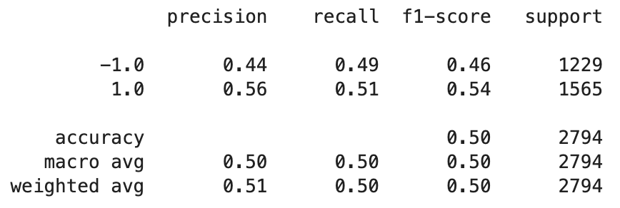

# Machine Learning Trading Bot
This project presented a scenario in which we would attempt to use machine learning and two simple moving averages to output a trading strategy (1 to buy long and -1 to sell short) that would outperform the provided assets daily cumulative returns, as well as a simple strategy of buying and selling based off of the previous day's closing price. Our data consisted of daily prices from January 21st, 2016 - January 22nd, 2021. After using the first three months of data for training the assets daily cumulative returns were 39%, which does alter somewhat during the project when the training period is lengthened and the moving averages are changed (due to dropping NA values). The simple trading strategy presented at the start of the project resulted in a loss of roughly 40%, though this does change to a loss of roughly 30% when fewer days are dropped from the beginning of the data due to the 100 SMA changing to a 50 SMA. 

## Original 
The original model was run using SVM's SVC classifier machine learning algorithm. We trained the model using the data's first 3 months of 4 day and 100 day simple moving averages, which would be used to predict a buy or sell signal. As we can see in the classification report bellow, the model's performance was less than stellar, with an accuracy value of 0.55, though the strategy returns of 57% do outperform the actual returns of 39%. 

## 4 and 50 SMA
In the first attempt at tuning the model a change was made to the simple moving averages, changing the 100 day to a 50 day moving average while keeping the 4 day moving average. We do see some slight improvements in the classification report for the recall and f1_score on the short signal (-1), but they are outweighed by the other values decreasing which resulted in a 0.54 accuracy value. Though the strategy returns of 32% do still slightly outweigh the actual returns of 31% (actual returns are altered due to the fewer NA values dropped when SMA was changed from 100 to 50). 

## 24 Month Training Window
In the second attempt at tuning the model a change was made to the models training data, changing it from 3 months to 24 months. We do see some good improvements in the classification report with the long (1) recall at an impressive 1.00 and the short(-1) precision nearly doubling to 0.80, but the short recall of 0.00 and short f1_score of 0.01 do diminish these improvements resulting in an accuracy value of 0.56. The major difference we see is in the strategy is the returns, increasing to 64%, which outperform the actual returns of 47% (actual returns are altered due to the greater number of days used in the training set, which are not included in the returns calculations). 

# AdaBoost
In the third alteration the model algorithm was switched from SVM's SVC classifier to the Ensemble Method AdaBoost. The classification report for the AdaBoost algorithm is nearly identical to the original model, including the same accuracy value of 0.55. Again, the major difference we see in the strategy is the returns, increasing to 57%, which outperform the original actual returns of 39%. 

# Best Combination - 24 Month Training Window with the AdaBoost Model
In the fourth attempt at creating the best model, the two best performing methods (24 month training window and the AdaBoost algorithm) were combined. The classification report for this combination of changes results in slightly more balanced recall and f1_score values between the long (0.50 and 0.54) and short (0.49 and 0.46) signals, though this does result in a lower accuracy value of 0.50. The strategy returns are very interesting and unexpected. In early to mid 2020 the strategy was outperforming the actual returns by an impressive margin (roughly 30% - 50%), but around the end of 2020 into the start of 2021 the strategy returns took a steep plunge while the actual returns had a strong rally. Due to the sharp change in returns the model formulated strategy resulted in returns of only 21% while the actual returns were 47%. 

We can understand this change in performance by looking back at the classification report. The recall and f1_score for the long signal resulted in significantly lower values than previously seen, which indicates the model does not perform as well at predicting long signals when the asset price is increasing. Although our model did have better recall and f1_score values for the short signal, causing the stronger returns from shorting the decreasing asset price in early 2020, the weaker capability to predict long signals and the market circumstances of the data proved to be the pitfall of this model. 

